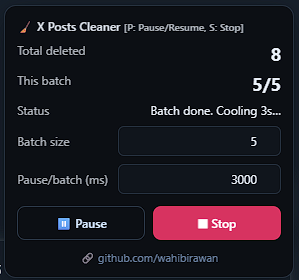

# 🧹 X Posts Deleter

A simple JavaScript script to automatically delete your posts on [X (Twitter)](https://x.com).  
Comes with a floating **GUI panel** to track progress, pause/resume, and stop.  

 <!-- optional, taruh screenshot hasil GUI -->

---

## ✨ Features
- Delete tweets in **batches** (default 5 per batch).
- **Pause/Resume** with button or shortcut (`P` key).
- **Stop** anytime with button or shortcut (`S` key).
- Configurable:
  - Batch size
  - Pause duration between batches
- Floating GUI with live status & counter.
- Footer credit link (customizable).

---

## 🚀 How to Use
1. Open [X](https://x.com) in your browser and log in.
2. Go to your profile page (where your tweets are listed).
3. Open **DevTools Console** (`F12` or `Ctrl+Shift+I` → Console).
4. Paste the script from [`auto-delete.js`](./auto-delete.js).
5. Press **Enter** → the GUI will appear in the bottom-right corner.

---

## 🎛️ Controls
- **Pause / Resume**
  - Click the Pause button OR press **P** key.
- **Stop**
  - Click the Stop button OR press **S** key.
  - GUI will disappear automatically.

---

## ⚙️ Configurations
Inside the GUI panel, you can change:
- **Batch size** → number of tweets deleted per run.
- **Pause/batch (ms)** → cooldown duration after each batch.

---

## 📸 Screenshots

### GUI Overlay  

### Progress in Action  

---

## ⚠️ Disclaimer
This tool is provided **as-is**.  
Use at your own risk — deleting tweets is permanent and cannot be undone.

---

## 👨‍💻 Author
Created by [wahibirawan](https://github.com/wahibirawan)  
Feel free to fork, contribute, or suggest improvements!

